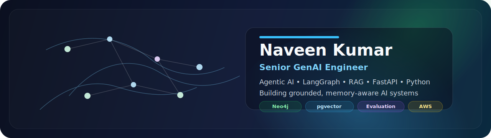

<!-- Premium GitHub Profile README for Naveen Kumar -->

  

<h1 align="center">Hi, I'm Naveen Kumar 👋</h1>

  <strong>Senior GenAI Engineer</strong> focused on <strong>agentic AI</strong>, <strong>grounded RAG</strong>, <strong>memory-aware AI systems</strong>, and <strong>production-ready Python backends</strong>.

  
  
  
  

  
  
  
  
  
  
  
  

---

## About Me

I build **production-grade GenAI systems** that go beyond a simple model call.

My work is centered around:
- **Agentic orchestration** with LangGraph / LangChain
- **Grounded retrieval systems** with vector search + knowledge graph constraints
- **Persistent memory and personalization** for AI products
- **FastAPI / Python backend engineering** for reliable AI APIs
- **Evaluation, safety, and reliability** for production deployment

At **Secondbrain Ventures**, I’ve worked on systems involving:
- multi-model routing across **GPT-4o, Claude, and Gemini**
- multimodal note ingestion pipelines with OCR, chunking, embedding, and KG linking
- memory-aware RAG with citations and verifier loops
- personalized revision and practice flows for learning products

---

## What I Build

<table>
  <tr>
    <td width="50%" valign="top">
      <h3>🧠 GenAI System Design</h3>
      <ul>
        <li>Agentic AI workflows</li>
        <li>LangGraph orchestration patterns</li>
        <li>Multi-model routing and fallback design</li>
        <li>Memory-aware AI product architecture</li>
      </ul>
    </td>
    <td width="50%" valign="top">
      <h3>🔎 Retrieval & Grounding</h3>
      <ul>
        <li>RAG pipelines with grounded citations</li>
        <li>Hybrid retrieval using vector DB + Neo4j</li>
        <li>Chunking, metadata filtering, reranking</li>
        <li>Evidence aggregation and answer verification</li>
      </ul>
    </td>
  </tr>
  <tr>
    <td width="50%" valign="top">
      <h3>⚙️ Backend Engineering</h3>
      <ul>
        <li>FastAPI services and AI APIs</li>
        <li>Pydantic schemas and structured outputs</li>
        <li>PostgreSQL / pgvector data design</li>
        <li>Async workflows, retries, observability</li>
      </ul>
    </td>
    <td width="50%" valign="top">
      <h3>📏 Reliability & Evaluation</h3>
      <ul>
        <li>Regression harnesses for GenAI features</li>
        <li>Citation and grounding quality checks</li>
        <li>Latency / cost / quality tradeoff tuning</li>
        <li>Production-first engineering mindset</li>
      </ul>
    </td>
  </tr>
</table>

---

## Core Stack

  

**GenAI / Retrieval**
- LangGraph
- LangChain
- OpenAI API
- Anthropic Claude
- Google Gemini
- pgvector
- FAISS
- Chroma
- Neo4j

**Backend / Infra**
- Python
- FastAPI
- PostgreSQL
- Pydantic
- Docker
- GitHub Actions
- AWS

**Quality / Delivery**
- Eval harnesses
- Prompt / retrieval regression checks
- Grounding validation
- Structured outputs
- Retry / fallback patterns

---

## Featured Work

> Pin your strongest GenAI / backend repositories at the top of your GitHub profile and keep this section aligned with them.

### 1. Secondbrain Memory Model (SBMM)
A production-oriented architecture for **memory-aware, grounded AI systems** with multi-thread chat, persistent learner memory, hybrid retrieval, citations, revision planning, and practice generation.

### 2. Agentic RAG with FastAPI + LangGraph
Starter architecture for building **production-ready AI workflows** using orchestrated nodes, retrieval layers, and backend APIs.

### 3. Neo4j + pgvector Hybrid Retrieval
A retrieval design pattern that combines **semantic similarity** with **relationship-aware graph precision** for more grounded AI responses.

### 4. Multimodal Note Ingestion Pipeline
OCR, typed-text extraction, note structuring, deduplication, chunking, tagging, and embeddings for AI-ready document ingestion.

### 5. GenAI Evaluation & Regression Harness
Tests and validation flows for **citation drift**, **retrieval failures**, **prompt regression**, and structured output reliability.

---

## Engineering Interests

I’m especially interested in building systems around:
- **Agentic AI**
- **LLM systems engineering**
- **Grounded RAG**
- **Knowledge graphs**
- **Persistent memory**
- **AI reliability / evaluation**
- **FastAPI / Python backends**
- **Applied GenAI product architecture**

---

## Currently Exploring

- scalable orchestration patterns for complex AI workflows
- better hybrid retrieval strategies for grounded responses
- memory write policies and controllable personalization
- efficient model routing between small and frontier models
- production evaluation for AI systems beyond prompt tuning

---

## Contact

  <a href="https://www.linkedin.com/in/naveen-kumar-2a9a63105">LinkedIn</a> •
  <a href="mailto:knaveen6868@gmail.com">Email</a> •
  <a href="https://secondbrainapp.in/">Secondbrain</a>

  Open to conversations around <strong>GenAI engineering</strong>, <strong>agentic AI</strong>, <strong>RAG systems</strong>, and <strong>AI backend architecture</strong>.

